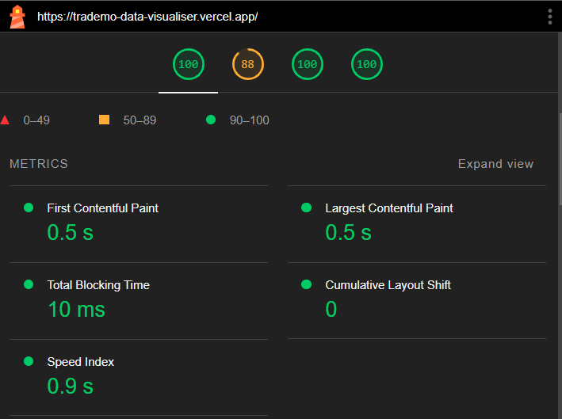

# Trademo Data Visualiser App

## Live Link
[Trademo Data Visualiser](https://trademo-data-visualiser.vercel.app/)

## GitHub Repository
[GitHub Repository](https://github.com/amit1884/trademo_data_visualiser)

## Framework and Plugins
1. **Framework:** React.js
2. **Packages:**
   - Chart.js
   - react-data-table-component
   - SASS

## Page Load Time
1. First Contentful Paint : 0.5s
2. Largest Contentful Paint: 0.5s
3. Total Blocking Time : 10ms
4. Cumulative Layout Shift: 0
5. Speed Index: 0.9s

 **Page Load Time Screeshot**
 

## Performance Optimizations
1. **Lazy Loading:** Implemented lazy loading to prevent unnecessary rendering/loading of components.

## Challenges and Solutions
1. **Data Modification for Graphs:** 
   - Challenge: Modifying the given data to fit the required format for creating graphs.
   - Solution: Wrote utility functions to transform and manipulate data to the desired structure.
